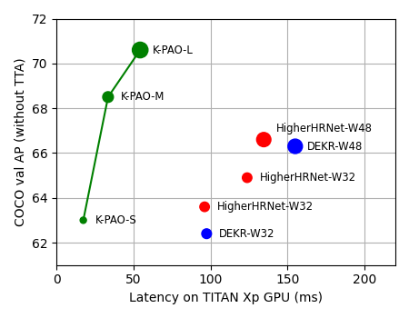

# KAPAO (Keypoints and Poses as Objects)

KAPAO is an efficient single-stage multi-person human pose estimation model that models 
**k**eypoints **a**nd **p**oses **a**s **o**bjects within a dense anchor-based detection framework. 
When not using test-time augmentation (TTA), KAPAO is much faster and more accurate than 
previous single-stage methods like [DEKR](https://github.com/HRNet/DEKR) 
and [HigherHRNet](https://github.com/HRNet/HigherHRNet-Human-Pose-Estimation): <br>



This repository contains the official PyTorch implementation for the paper: <br>
[Rethinking Keypoint Representations: Modeling Keypoints and Poses as Objects for Multi-Person Human Pose Estimation](https://arxiv.org/abs/2111.08557).

Our code was forked from ultralytics/yolov5 at commit [5487451](https://github.com/ultralytics/yolov5/tree/5487451).

### Setup
1. If you haven't already, [install Anaconda or Miniconda](https://docs.conda.io/projects/conda/en/latest/user-guide/install/index.html).
2. Create a new conda environment with Python 3.6: `$ conda create -n kapao python=3.6`.
3. Activate the environment: `$ conda activate kapao`
4. Clone this repo: `$ git clone https://github.com/wmcnally/kapao.git`
5. Install the dependencies: `$ cd kapao && pip install -r requirements.txt`
6. Download the trained models: `$ sh data/scripts/download_models.sh`

### Inference Demos

**Note:** FPS calculations includes **all processing**, including inference, plotting / tracking, image resizing, etc. 
See demo script arguments for inference options.

#### Flash Mob Demo
This demo runs inference on a 720p dance video (native frame-rate of 25 FPS).

<br>

To display the inference results in real-time: <br> 
`$ python demos/flash_mob.py --weights kapao_s_coco.pt --display --fps`

To create the GIF above:<br>
`$ python demos/flash_mob.py --weights kapao_s_coco.pt --start 188 --end 196 --gif --fps`<br>

#### Squash Demo
This demo runs inference on a 1080p slow motion squash video (native frame-rate of 25 FPS). It uses a simple player tracking algorithm based on the frame-to-frame pose differences.

<br>

To display the inference results in real-time: <br> 
`$ python demos/squash.py --weights kapao_s_coco.pt --display --fps`

To create the GIF above:<br>
`$ python demos/squash.py --weights kapao_s_coco.pt --start 42 --end 50 --gif --fps`<br>

## COCO Experiments
Download the COCO dataset:  `$ sh data/scripts/get_coco_kp.sh`

### Validation (without TTA)
- KAPAO-S (63.0 AP): `$ python val.py --rect`
- KAPAO-M (68.5 AP): `$ python val.py --rect --weights kapao_m_coco.pt`
- KAPAO-L (70.6 AP): `$ python val.py --rect --weights kapao_l_coco.pt`

### Validation (with TTA)
- KAPAO-S (64.3 AP): `$ python val.py --scales 0.8 1 1.2 --flips -1 3 -1`
- KAPAO-M (69.6 AP): `$ python val.py --weights kapao_m_coco.pt \ `<br>
`--scales 0.8 1 1.2 --flips -1 3 -1` 
- KAPAO-L (71.6 AP): `$ python val.py --weights kapao_l_coco.pt \ `<br>
`--scales 0.8 1 1.2 --flips -1 3 -1` 

### Testing
- KAPAO-S (63.8 AP): `$ python val.py --scales 0.8 1 1.2 --flips -1 3 -1 --task test` 
- KAPAO-M (68.8 AP): `$ python val.py --weights kapao_m_coco.pt \ `<br>
`--scales 0.8 1 1.2 --flips -1 3 -1 --task test` 
- KAPAO-L (70.3 AP): `$ python val.py --weights kapao_l_coco.pt \ `<br>
`--scales 0.8 1 1.2 --flips -1 3 -1 --task test` 


### Training
The following commands were used to train the KAPAO models on 4 V100s with 32GB memory each.

KAPAO-S:
```
python -m torch.distributed.launch --nproc_per_node 4 train.py \
--img 1280 \
--batch 128 \
--epochs 500 \
--data data/coco-kp.yaml \
--hyp data/hyps/hyp.kp-p6.yaml \
--val-scales 1 \
--val-flips -1 \
--weights yolov5s6.pt \
--project runs/s_e500 \
--name train \
--workers 128
```

KAPAO-M:
```
python train.py \
--img 1280 \
--batch 72 \
--epochs 500 \
--data data/coco-kp.yaml \
--hyp data/hyps/hyp.kp-p6.yaml \
--val-scales 1 \
--val-flips -1 \
--weights yolov5m6.pt \
--project runs/m_e500 \
--name train \
--workers 128
```

KAPAO-L:
```
python train.py \
--img 1280 \
--batch 48 \
--epochs 500 \
--data data/coco-kp.yaml \
--hyp data/hyps/hyp.kp-p6.yaml \
--val-scales 1 \
--val-flips -1 \
--weights yolov5l6.pt \
--project runs/l_e500 \
--name train \
--workers 128
```

**Note:** [DDP](https://pytorch.org/tutorials/intermediate/ddp_tutorial.html) is usually recommended but we found training was less stable for KAPAO-M/L using DDP. We are investigating this issue.

## CrowdPose Experiments
- Install the [CrowdPose API](https://github.com/Jeff-sjtu/CrowdPose/tree/master/crowdpose-api) to your conda environment: <br>
`$ cd .. && git clone https://github.com/Jeff-sjtu/CrowdPose.git` <br>
`$ cd CrowdPose/crowdpose-api/PythonAPI && sh install.sh && cd ../../../kapao`
- Download the CrowdPose dataset:  `$ sh data/scripts/get_crowdpose.sh`

### Testing
- KAPAO-S (63.8 AP): `$ python val.py --data crowdpose.yaml \ `<br>
`--weights kapao_s_crowdpose.pt --scales 0.8 1 1.2 --flips -1 3 -1` 
- KAPAO-M (67.1 AP): `$ python val.py --data crowdpose.yaml \ `<br>
`--weights kapao_m_crowdpose.pt --scales 0.8 1 1.2 --flips -1 3 -1`
- KAPAO-L (68.9 AP): `$ python val.py --data crowdpose.yaml \ `<br>
`--weights kapao_l_crowdpose.pt --scales 0.8 1 1.2 --flips -1 3 -1`

### Training
The following commands were used to train the KAPAO models on 4 V100s with 32GB memory each. 
Training was performed on the `trainval` split with no validation. 
The test results above were generated using the last model checkpoint.

KAPAO-S:
```
python -m torch.distributed.launch --nproc_per_node 4 train.py \
--img 1280 \
--batch 128 \
--epochs 300 \
--data data/crowdpose.yaml \
--hyp data/hyps/hyp.kp-p6.yaml \
--val-scales 1 \
--val-flips -1 \
--weights yolov5s6.pt \
--project runs/cp_s_e300 \
--name train \
--workers 128 \
--noval
```
KAPAO-M:
```
python train.py \
--img 1280 \
--batch 72 \
--epochs 300 \
--data data/coco-kp.yaml \
--hyp data/hyps/hyp.kp-p6.yaml \
--val-scales 1 \
--val-flips -1 \
--weights yolov5m6.pt \
--project runs/cp_m_e300 \
--name train \
--workers 128 \
--noval
```
KAPAO-L:
```
python train.py \
--img 1280 \
--batch 48 \
--epochs 300 \
--data data/crowdpose.yaml \
--hyp data/hyps/hyp.kp-p6.yaml \
--val-scales 1 \
--val-flips -1 \
--weights yolov5l6.pt \
--project runs/cp_l_e300 \
--name train \
--workers 128 \
--noval
```

## Acknowledgements
This work was supported in part by Compute Canada, the Canada Research Chairs Program, 
the Natural Sciences and Engineering Research Council of Canada, 
a Microsoft Azure Grant, and an NVIDIA Hardware Grant.

If you find this repo is helpful in your research, please cite our paper:
```
@article{mcnally2021kapao,
  title={Rethinking Keypoint Representations: Modeling Keypoints and Poses as Objects for Multi-Person Human Pose Estimation},
  author={McNally, William and Vats, Kanav and Wong, Alexander and McPhee, John},
  journal={arXiv preprint arXiv:2111.08557},
  year={2021}
}
```
Please also consider citing our previous works:
```
@inproceedings{mcnally2021deepdarts,
  title={DeepDarts: Modeling Keypoints as Objects for Automatic Scorekeeping in Darts using a Single Camera},
  author={McNally, William and Walters, Pascale and Vats, Kanav and Wong, Alexander and McPhee, John},
  booktitle={Proceedings of the IEEE/CVF Conference on Computer Vision and Pattern Recognition},
  pages={4547--4556},
  year={2021}
}

@article{mcnally2021evopose2d,
  title={EvoPose2D: Pushing the Boundaries of 2D Human Pose Estimation Using Accelerated Neuroevolution With Weight Transfer},
  author={McNally, William and Vats, Kanav and Wong, Alexander and McPhee, John},
  journal={IEEE Access},
  volume={9},
  pages={139403--139414},
  year={2021},
  publisher={IEEE}
}
```
